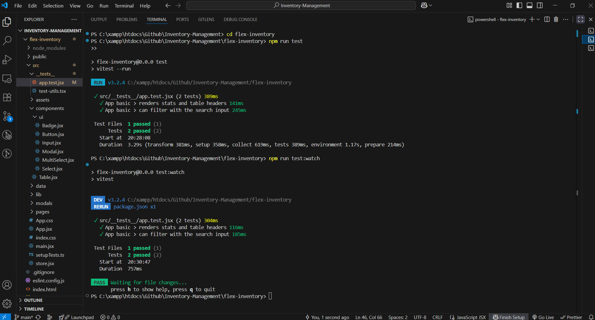
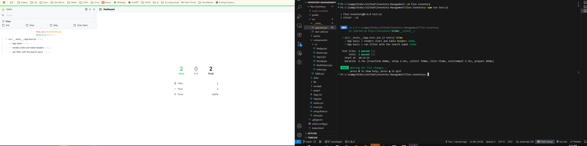

# Inventory Management - Albina Ahmeti

# Inventory-Management

# Flex Business Solutions – Inventory Management

App i vogël për menaxhimin e inventarit nëpër **job sites** sipas një dizajni të dhënë në Figma. Mundëson:
- listimin e job site-eve me status,
- krijimin e job site të ri,
- kërkim (search) në listë,
- hyrje në një job site për të parë **inventory** sipas kategorive,
- **edit** të item-eve përmes modalit (double-click në qeli),
- ruajtje të të dhënave në **localStorage** (persistencë e lehtë).

> **Figma:** https://www.figma.com/file/uOxY3AiUFaGuxsU9nk0H1O/ReactJs-Test?node-id=0%3A1

---

## ⚙️ Teknologjitë kryesore
- **React 18**, **React Router**
- **Vitest** + **@testing-library/react** (unit tests)
- Persistencë e lehtë me **localStorage**
- CSS e thjeshtë me variabla dhe utilitare

---

## 🚀 Si ta nisësh lokalisht

### 1) Kërkesat
- Node.js 18+ (ose 20+ e rekomanduar)
- npm 9+

### 2) Instalimi
```bash
npm install
```

### 3) Dev server
```bash
npm run dev
```
Hapet zakonisht tek: **http://localhost:5173**

### 4) Build & Preview
```bash
npm run build
npm run preview
```

---

## 🧪 Testet

**Run një herë (CI-style)**
```bash
npm run test
```

**Watch mode (developer UX)**
```bash
npm run test:watch
```

**UI e Vitest (dashboard web)**  
Nëse ke një script `test:ui`, përdore:
```bash
npm run test:ui
```
ose direkt:
```bash
npx vitest --ui
```
Hapet tek: `http://localhost:51204/__vitest__` (porta mund të ndryshojë).

**Çfarë testojmë**
- Renderimi i homepage (stats + tabela)
- Filtrimi me inputin e kërkimit  
  (Mocks për `seedData` & `localStorage` për teste të qëndrueshme)

---

## 📁 Strukturë e shkurtër e dosjeve
```text
src/
  __tests__/
    app.test.jsx          # teste kryesore të App
    test-utils.tsx        # wrapper me StoreProvider + MemoryRouter
  assets/
    box.png               # ilustrim “empty state”
  components/
    Table.jsx             # tabela e listës
    ui/
      Badge.jsx
      Button.jsx
      Input.jsx
      Modal.jsx
      MultiSelect.jsx
      Select.jsx
  data/
    seed.js               # gjenerim i të dhënave seed
  lib/
    storage.js            # load/save nga localStorage
  modals/
    EditItemModal.jsx     # modal për përditësim të item-it
  pages/
    Home.jsx              # faqja kryesore (listë job sites)
    Details.jsx           # inventory i një job site
  store.js                # context + reducer (ADD_JOBSITE, ADD_ITEM, UPDATE_ITEM)
  App.jsx
  main.jsx
  index.css
setupTests.ts             # jest-dom + cleanup + clear localStorage
```

---

## 💾 Persistenca & Seed
- App ngarkohet fillimisht nga `seedData()` dhe ruhet në `localStorage`.
- Çdo ndryshim (create/update) persiston automatikisht.

**Për ta resetuar app-in (fshirë të dhënat lokale):**
- Mbylle app-in dhe fshi `localStorage` për domain-in nga browser-i  
  (DevTools → Application → Local Storage → *Clear*).  
- Në testet e Vitest kjo bëhet automatikisht në `setupTests.ts`.

---

## 🖼️ Screenshots
> Përfshiji këto skedarë në repo nëse dëshiron të shfaqen në GitHub.




---

## ✅ Detyrat e realizuara (sipas kërkesës)
- Listë job sites + status (badge & stats)
- Krijo job site të ri (Modal → dispatch `ADD_JOBSITE`)
- Kërkim në home & në inventory (filter në memory)
- Editim i item-eve me modal (double-click në qeli → `UPDATE_ITEM`)
- Unit tests me Vitest + RTL (mock për seed & storage)

---

## 🔒 Si ta bënim më të sigurt
- Kalim nga `localStorage` → API backend (authn/authz, rate-limit, audit log).
- Validim i inputeve në UI dhe në backend (zbutje e injection).
- **Zod/Yup** schema validation për forma dhe payload.
- CSP, X-Frame-Options, sanitizim HTML (nëse futet rich text).
- Feature flags për operacione rrezikshme (p.sh. bulk delete/edit).

---

## 📈 Si të shkallëzohet në miliona rreshta
- Server-side pagination + cursor-based pagination (jo offset).
- Indekse në DB (për kolonat e kërkimit), full-text search (PG trigram/TSV, Elastic/Meilisearch për at-scale).
- Caching (HTTP 304/ETags, CDN për assete, Redis për queries të rënda).
- Virtualized lists në UI (p.sh. `react-virtual`/`react-window`).
- Event-driven updates (WebSocket/SSE) për refresh minimal.
- Shpërndarje horizontale: API stateless + autoscale; DB read-replicas/sharding (kur është e nevojshme).

